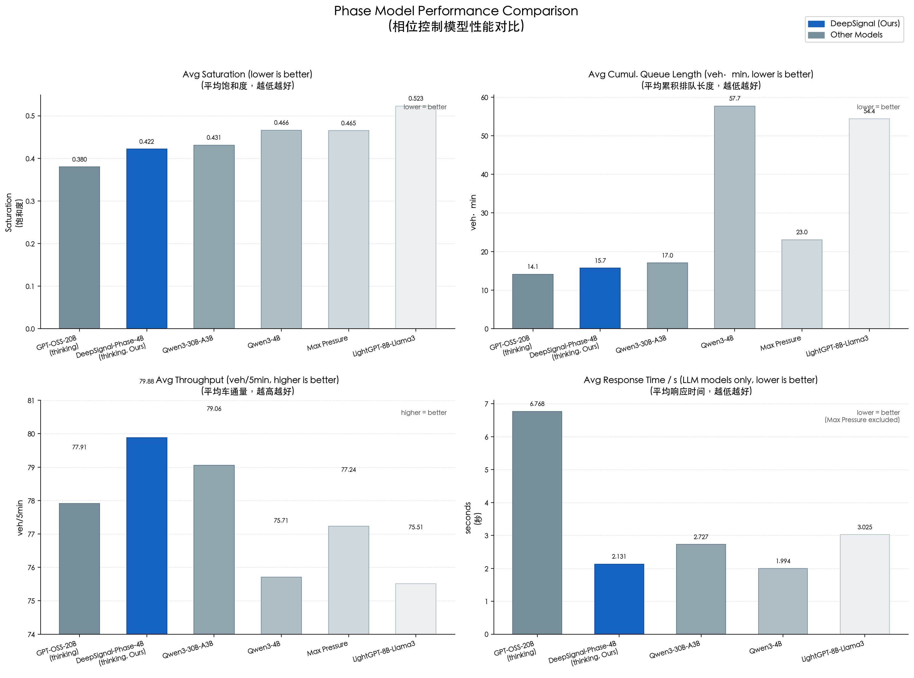
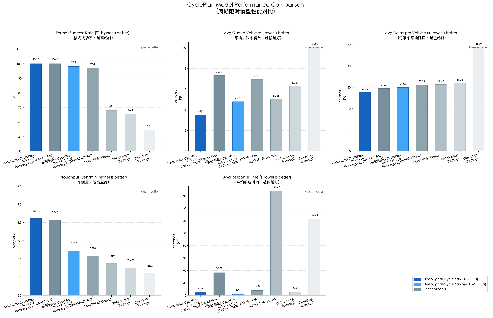
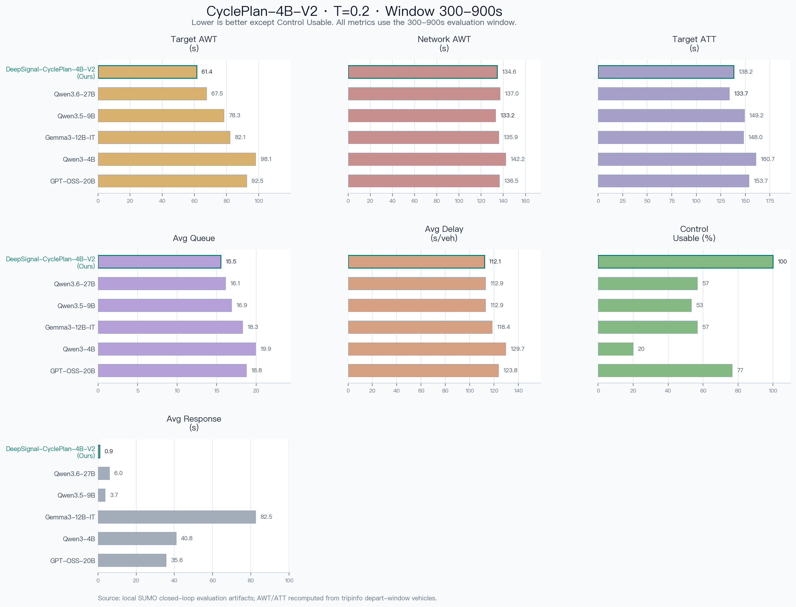
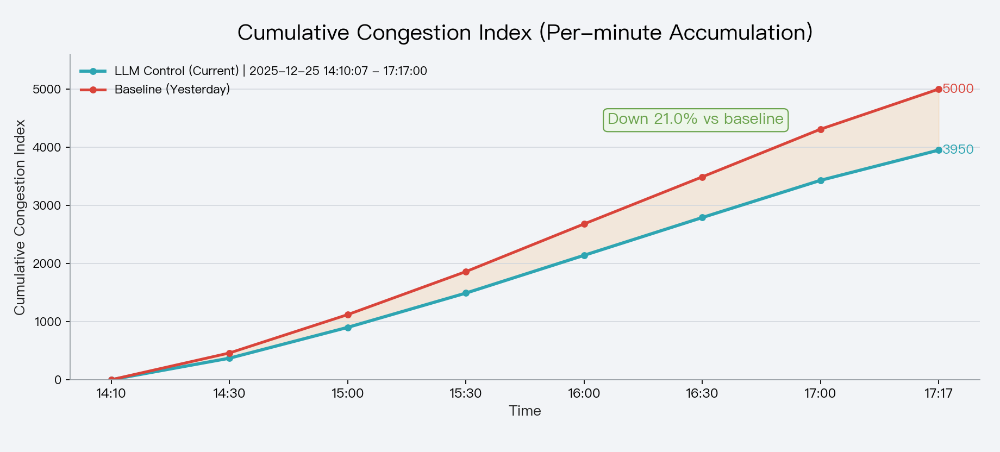

# DeepSignal — Traffic Signal Control via LLM

[中文 README](README_zh.md)

DeepSignal is our suite of fine-tuned large language models for **traffic-signal control**. The current releases include three models:

- **DeepSignal-Phase-4B-V1** — next signal-phase prediction (predicts which phase to activate next and for how long)
- **DeepSignal-CyclePlan-4B-V1** — signal-cycle timing optimization (outputs green-time allocation for every phase in the upcoming cycle)
- **DeepSignal-CyclePlan-4B-V2** — updated CyclePlan release with stronger executable timing-plan generation, faster response, and improved queue/delay behavior

All models are available on Hugging Face under the same repository:

**Model (Hugging Face)**: [`AIMS2025/DeepSignal`](https://huggingface.co/AIMS2025/DeepSignal) (contains both Phase and CyclePlan model files)

This repository also contains a SUMO-based simulation stack and an MCP server to run closed-loop interaction between the LLM and traffic simulations, to evaluate the performance of various baseline signal control models/algorithms. Currently, this repository does not include the code for fine-tuning the large language model.

## Team

- **Team name**: AIMSLab
- **Team members**: Feng Xiao, Da Lei, Lu Li, Yuzhan Liu, Jinyou Chi, Yabang Wang. (Thanks Minyu Shen and Dapeng Zhang, for their contribution in the real-world deployment of LLM-based traffic signal control) 
- **Team leader**: Feng Xiao (homepage: <https://bs.scu.edu.cn/guanlikexue/202403/9185.html>)
- **Contact**: <trains.ai.lab@gmail.com>


## Key idea: Offline + Online training

We fine-tune DeepSignal using a two-stage learning pipeline:

- **Offline learning (SFT)**: supervised fine-tuning on instruction-style data to learn traffic-state analysis and signal-control decision formatting.
- **Online learning (RL with SUMO)**: reinforcement learning by interacting with SUMO simulations (closed-loop), using diverse scenarios under `scenarios/`.

## DeepSignal-Phase-4B-V1

DeepSignal-Phase-4B-V1 is designed for **next signal-phase prediction**. Given the current traffic scene and state at an intersection, it predicts which signal phase to activate next and for how long.

**Prompt example:**

```
You are a traffic management expert. You can use your traffic knowledge to solve the traffic signal control task.
Based on the given traffic scene and state, optimize the next signal phase and its duration.
You must answer directly, the format must be: next signal phase: {number}, duration: {seconds} seconds
where the number is the phase index (starting from 0) and the seconds is the duration (usually between 20-90 seconds).
```

## DeepSignal-CyclePlan-4B-V1

DeepSignal-CyclePlan-4B-V1 is designed for **signal-cycle timing optimization**. It takes predicted traffic state data for the upcoming cycle as input and outputs green-time allocations for every phase.

**System Prompt:**

```
You are a traffic signal timing optimization expert.
Please carefully analyze the predicted traffic states for each phase in the next cycle, provide the timing plan for the next cycle, and give your reasoning process.
Place the reasoning process between <start_working_out> and <end_working_out>.
Then, place your final plan between <SOLUTION> and </SOLUTION>.
```

**User Prompt (template):**

```
【cycle_predict_input_json】{
  "prediction": {
    "as_of": "<timestamp>",
    "phase_waits": [
      {
        "phase_id": <int>,
        "pred_saturation": <float>,
        "min_green": <int>,
        "max_green": <int>,
        "capacity": <int>
      }
      // ... more phases
    ]
  }
}【/cycle_predict_input_json】

Task (must complete):
Mainly based on prediction.phase_waits pred_saturation (already calculated), output the final green light time for each phase in the next cycle (unit: seconds), while satisfying hard constraints.

Field descriptions (meaning only):
- prediction.phase_waits[*].min_green / max_green: seconds
- prediction.phase_waits[*].pred_saturation: predicted saturation (pred_wait / capacity)
- prediction.phase_waits[*].capacity: phase capacity (vehicle capacity)

Hard constraints (must satisfy):
1) Fixed phase order: output strictly in the order of prediction.phase_waits; no skipping, no reordering.
2) Per-phase constraint: final must satisfy prediction.phase_waits[*].min_green ≤ final ≤ prediction.phase_waits[*].max_green.
3) final must be an integer in seconds.

Hints (non-hard constraints):
- capacity is for reference only; final decision should be based primarily on pred_saturation.

Output format:
1) JSON top level must be an array (list); array length must equal prediction.phase_waits length.
2) Array elements must be objects: {"phase_id": <int>, "final": <int>}; no other fields allowed.
```

**Input format**: JSON wrapped in `【cycle_predict_input_json】...【/cycle_predict_input_json】` tags, containing `prediction.phase_waits` — an array of per-phase objects with `phase_id`, `pred_saturation`, `min_green`, `max_green`, and `capacity`. Here `pred_saturation = pred_wait / capacity`, where `pred_wait` is the predicted number of waiting vehicles for this phase in the next cycle, which can be computed using forecasting models (e.g., LSTM, TCN) based on historical traffic data.

**Output format**: A JSON array of objects `[{"phase_id": <int>, "final": <int>}, ...]`, where `final` is the allocated green time in integer seconds for each phase.

## DeepSignal-CyclePlan-4B-V2

DeepSignal-CyclePlan-4B-V2 is an updated CyclePlan release for local inference with `llama.cpp`, LM Studio, and other GGUF-compatible runtimes. It keeps the same cycle-level control objective as V1: given phase-level predicted traffic states and green-time constraints for an intersection, it outputs the final green-light duration for every phase in the next signal cycle.

This release follows the Qwen3 4B architecture family and is intended for SUMO simulation, traffic signal timing research, and local controller prototyping. During evaluation, the model uses the DeepSignal prompt style: a short reasoning block followed by a strict JSON timing plan inside `<SOLUTION>...</SOLUTION>`.

**System Prompt:**

```
You are a traffic signal timing optimization expert.
```

**User Prompt (template):**

```
【cycle_predict_input_json】{
  "prediction": {
    "as_of": "<timestamp>",
    "phase_waits": [
      {
        "phase_id": <int>,
        "pred_wait": <float>,
        "pred_saturation": <float>,
        "min_green": <int>,
        "max_green": <int>,
        "capacity": <int>
      }
      // ... more phases
    ]
  }
}【/cycle_predict_input_json】

Task (must complete):
Based on prediction.phase_waits[*].pred_saturation, output the final green time final for each phase in the next cycle (unit: seconds), while satisfying all hard constraints.

Input field descriptions:
- prediction.phase_waits[*].min_green / max_green: lower and upper green-time bounds, in seconds.
- prediction.phase_waits[*].pred_wait: predicted waiting vehicles.
- prediction.phase_waits[*].pred_saturation: predicted saturation (pred_wait / capacity).
- prediction.phase_waits[*].capacity: phase capacity, for reference only.

Hard constraints (must satisfy):
1) Fixed phase order: consider and output strictly in the order of prediction.phase_waits; no skipping and no reordering.
2) Per-phase constraint: final must satisfy prediction.phase_waits[*].min_green <= final <= prediction.phase_waits[*].max_green.
3) final must be an integer in seconds.

Decision hint (non-hard constraint):
- The final decision should be based primarily on pred_saturation; capacity is for reference only.

Output requirements (must strictly follow):
1) First output <start_working_out>...</end_working_out>; include only the reasoning process there, not the final JSON.
2) Then output <SOLUTION>...</SOLUTION>; inside <SOLUTION>, only the final JSON is allowed.
3) JSON top level must be an object/dict; keys are phase IDs as strings and values are integer seconds. Keys must use double quotes.
4) The JSON must cover all phase IDs in prediction.phase_waits, with no missing or extra phases.
5) Do not output any text outside <start_working_out>...</end_working_out> and <SOLUTION>...</SOLUTION>.
```

**Input format**: JSON wrapped in `【cycle_predict_input_json】...【/cycle_predict_input_json】` tags, containing `prediction.phase_waits` with `phase_id`, `pred_wait`, `pred_saturation`, `min_green`, `max_green`, and `capacity`. Here `pred_saturation = pred_wait / capacity`.

**Output format**: A reasoning block followed by a JSON object inside `<SOLUTION>...</SOLUTION>`, for example `<SOLUTION>{"1": 55, "2": 30}</SOLUTION>`, where each key is a phase ID string and each value is the allocated green time in integer seconds.

## Changelog

- **2025-12-16**: Released DeepSignal-4B-V1 (next signal-phase prediction model).
- **2026-02-22**: Renamed the original model to **DeepSignal-Phase-4B-V1**; released **DeepSignal-CyclePlan-4B-V1** (signal-cycle timing optimization model).
- **2026-07-01**: Released **DeepSignal-CyclePlan-4B-V2**.

## Scenarios (training vs hold-out evaluation)

During online interaction, we use the SUMO scenarios under `scenarios/`. We also evaluate generalization on hold-out scenarios that are **NOT used in training**.

| City/Region | Case directory | Config | Signalized intersections | Usage | Notes |
|---|---|---:|---:|---|---|
| Bad Hersfeld | `BadHersfeld_osm_osm` | `osm.sumocfg` | 24 | Train | OSM |
| Bologna | `bologna_acosta_run` | `run.sumocfg` | 16 | Train | Acosta |
| Bologna | `bologna_joined_run` | `run.sumocfg` | 29 | Train | Joined |
| Bologna | `bologna_pasubio_run` | `run.sumocfg` | 15 | Train | Pasubio |
| Doerpfeldstr | `Doerpfeldstr_all_modes` | `all_modes.sumocfg` | 10 | Train | Doerpfeldstr |
| PORT tutorial | `port_tutorials_port_brunswick_osm` | `osm.sumocfg` | 20 | Train | Brunswick OSM |
| Arterial 4×4 | `arterial4x4` | `arterial4x4.sumocfg` | 16 | Train | Synthetic |
| Grid 4×4 | `grid4x4` | `grid4x4.sumocfg` | 16 | Train | Synthetic |
| Cologne | `cologne1` | `cologne1.sumocfg` | 1 | Eval | Not used in training |
| Cologne | `cologne3` | `cologne3.sumocfg` | 3 | Eval | Not used in training |
| Cologne | `cologne8` | `cologne8.sumocfg` | 8 | Eval | Not used in training |
| Ingolstadt | `ingolstadt1` | `ingolstadt1.sumocfg` | 1 | Eval | Not used in training |
| Ingolstadt | `ingolstadt21` | `ingolstadt21.sumocfg` | 24 | Eval | Not used in training |
| Ingolstadt | `ingolstadt7` | `ingolstadt7.sumocfg` | 7 | Eval | Not used in training |
| Chengdu | `sumo_llm` | `osm.sumocfg` | 46 | Eval | Not used in training |

`*`：Different intersections and different traffic flow conditions together form 22,561 training scenarios and 2,000 evaluation scenarios.

## Results from SUMO Simulation

### Evaluation metrics

We evaluate DeepSignal in **SUMO simulation** using intersection-level metrics computed from the simulator:

- **Avg Saturation** (`average_saturation`)
- **Avg Cumulative Queue Length** (`average_cumulative_queue_length`)
- **Avg Throughput** (veh/5min)
- **Avg Response Time** (s; LLM-only)

For **CyclePlan model** evaluation, we use the following additional metrics:

- **Format Success Rate**: The percentage of model outputs that conform to the expected JSON format (`[{"phase_id": <int>, "final": <int>}, ...]`).
- **Avg Queue Vehicles**: The average number of vehicles waiting in queue across all phases and time steps.
- **Avg Delay per Vehicle**: The average delay time in seconds experienced per vehicle at the intersection.
- **Throughput (veh/min)**: The number of vehicles passing through the intersection per minute (computed as raw throughput × 60).
- **Avg Response Time** (s; LLM-only): The average time for the model to generate a response.

#### Metric computation (formulas)

Let $t$ index simulation steps in a time window, and $l$ index controlled lanes at an intersection.

- Per-lane/approach capacity (saturation capacity):
  - $c_l = s_l \cdot \dfrac{g_l}{C}$
  - where $s_l$ is the saturation flow rate (veh/h/ln, typically 1800–1900 or field-calibrated), $g_l$ is the effective green time (s; after subtracting start-up loss and clearance loss), and $C$ is the cycle length (s).
- Per-lane saturation degree ($v/c$):
  - $X_{t,l}=\dfrac{v_{t,l}}{c_l}=\dfrac{v_{t,l}}{s_l\cdot (g_l/C)}$
  - where $v_{t,l}$ is the observed flow rate on lane $l$ in the time window (veh/h/ln).
- Per-lane queue length (vehicle count): $q_{t,l}$
  - where $q_{t,l}$ is the number of vehicles queued on lane $l$ at time step $t$.
- Weighted averages over lanes/lane-groups ( $\sum_l w_{t,l}=1$ ; weights can follow flow share or lane importance):

$$
\bar{X}_t=\sum_l w_{t,l} X_{t,l}, \quad \bar{q}_t=\sum_l w_{t,l} q_{t,l}
$$

- Window metrics over $T$ steps (where each step represents 1 minute):
  - `average_saturation` $= \dfrac{1}{T}\sum_{t=1}^{T}\bar{X}_t$
  - `average_cumulative_queue_length` $= \sum_{t=1}^{T}\bar{q}_t$ (unit: veh⋅min)

### Performance Metrics Comparison by Model (Phase) $^{*}$

| Model | Avg Saturation | Avg Cumulative Queue Length (veh⋅min) | Avg Throughput (veh/5min) | Avg Response Time (s) |
|:---:|:---:|:---:|:---:|:---:|
| [`GPT-OSS-20B (thinking)`](https://huggingface.co/openai/gpt-oss-20b) | 0.380 | 14.088 | 77.910 | 6.768 |
| **DeepSignal-Phase-4B (thinking, Ours)** | 0.422 | 15.703 | **79.883** | 2.131 |
| [`Qwen3-30B-A3B`](https://huggingface.co/Qwen/Qwen3-VL-30B-A3B-Instruct) | 0.431 | 17.046 | 79.059 | 2.727 |
| [`Qwen3-4B`](https://huggingface.co/Qwen/Qwen3-4B-Instruct-2507) | 0.466 | 57.699 | 75.712 | 1.994 |
| Max Pressure | 0.465 | 23.022 | 77.236 | ** |
| [`LightGPT-8B-Llama3`](https://huggingface.co/lightgpt/LightGPT-8B-Llama3) | 0.523 | 54.384 | 75.512 | 3.025*** |

`*`: Each simulation scenario runs for 60 minutes. We discard the first **5 minutes** as warm-up, then compute metrics over the next **20 minutes** (minute 5 to 25). We cap the evaluation window because, when an LLM controls signal timing for only a single intersection, spillback from neighboring intersections may occur after ~20+ minutes and destabilize the scenario. All evaluations are conducted on a **Mac Studio M3 Ultra**.  
`**`: Max Pressure is a fixed signal-timing optimization algorithm (not an LLM), so we omit its Avg Response Time; this metric is only defined for LLM-based signal-timing optimization.  
`***`: For LightGPT-8B-Llama3, Avg Response Time is computed using only the successful responses. Note that LightGPT-8B-Llama3 includes tool calls, and typically needs to be used together with the simulation platform and programs described in [LLMTSCS](https://github.com/usail-hkust/LLMTSCS?tab=readme-ov-file). In our simulation scenarios, the success rate of valid LLM responses is not high, which could lead to lower performance.

**Conclusion**: Among thinking-enabled models, **DeepSignal-Phase-4B** achieves the highest throughput (79.883 veh/5min) with a response time of only 2.131s. GPT-OSS-20B achieves the best saturation (0.380) but with higher response latency (6.768s).



### CyclePlan-4B-V1 Model Evaluation Comparison $^{*}$

| Model | Format Success Rate (%) | Avg Queue Vehicles | Avg Delay per Vehicle (s) | Throughput (veh/min) | Avg Response Time (s) |
|:---:|:---:|:---:|:---:|:---:|:---:|
| **DeepSignal-CyclePlan-4B-V1 F16 (thinking, Ours)** | **100.0** | **3.504** | **27.747** | **8.611** | 4.351 |
| [`GLM-4.7-Flash (thinking)`](https://huggingface.co/zai-org/glm-4.7-flash) | 100.0 | 7.323 | 29.422 | 8.567 | 36.388 |
| DeepSignal-CyclePlan-4B-V1 Q4_K_M (thinking, Ours) | 98.1 | 4.783 | 29.891 | 7.722 | 1.674 |
| [`Qwen3-30B-A3B`](https://huggingface.co/Qwen/Qwen3-30B-A3B-2507) | 97.1 | 6.938 | 31.135 | 7.578 | 7.885 |
| [`LightGPT-8B-Llama3`](https://huggingface.co/lightgpt/LightGPT-8B-Llama3) | 68.0 | 5.026 | 31.266 | 7.380 | 167.373 |
| [`GPT-OSS-20B (thinking)`](https://huggingface.co/openai/gpt-oss-20b) | 65.4 | 6.289 | 31.947 | 7.247 | 4.919 |
| [`Qwen3-4B (thinking)`](https://huggingface.co/Qwen/Qwen3-4B-Instruct-2507) | 54.1 | 10.060 | 48.895 | 7.096 | 122.333 |

`*`: Each simulation scenario runs for 60 minutes. We discard the first **5 minutes** as warm-up, then compute metrics over the next **20 minutes** (minute 5 to 25). All evaluations are conducted on a **Mac Studio M3 Ultra**.

**Conclusion**: DeepSignal-CyclePlan-4B-V1 (F16) achieves a 100% format success rate, the lowest average queue vehicles (3.504), and the highest throughput (8.611 veh/min) among all evaluated models. The Q4_K_M quantized version maintains strong performance with 98.1% format success rate while offering the fastest response time (1.674s).



### CyclePlan-4B-V2 Model Evaluation Comparison $^{**}$

We evaluate `DeepSignal-CyclePlan-4B-V2` in a SUMO closed-loop traffic simulation. At each decision cycle, the model receives predicted phase-level waiting vehicles, predicted saturation, and phase-specific minimum and maximum green constraints. The generated timing plan is then applied to SUMO, and the simulation records both traffic-operation metrics and model-execution metrics. All evaluations were conducted on an **NVIDIA GeForce RTX 5090 GPU**.

This comparison uses the `300-900s` evaluation window and model temperature `0.2` to inspect early vehicle-level waiting behavior, queue level, travel time, and control-output stability.

Additional metric definitions for this V2 evaluation:

- **Target AWT**: average waiting time of vehicles associated with the target intersections, computed from SUMO `tripinfo`, in seconds. Lower is better.
- **Network AWT**: average waiting time of completed vehicles over the whole network, computed from SUMO `tripinfo`, in seconds. Lower is better.
- **Target ATT**: average travel time of vehicles associated with the target intersections, computed from completed-trip duration, in seconds. Lower is better.
- **Control Usable**: percentage of model outputs that can be parsed, pass timing-constraint checks, and be used as executable control plans. Higher is better.

Let $\mathcal{V}_{target}$ be the set of vehicles associated with the target intersections that depart within the evaluation window and complete their trips. Let $\mathcal{V}_{network}$ be the set of all completed network vehicles satisfying the same window condition. $w_i$ is the accumulated waiting time of vehicle $i$ recorded in SUMO `tripinfo`, and $\tau_i=a_i-d_i$ is its completed-trip duration.

$$
\mathrm{TargetAWT}=\frac{\sum_{i \in \mathcal{V}_{target}} w_i}{|\mathcal{V}_{target}|}, \quad
\mathrm{NetworkAWT}=\frac{\sum_{i \in \mathcal{V}_{network}} w_i}{|\mathcal{V}_{network}|}
$$

$$
\mathrm{TargetATT}=\frac{\sum_{i \in \mathcal{V}_{target}} \tau_i}{|\mathcal{V}_{target}|}
$$

| Model | Temp | Target AWT (s) | Network AWT (s) | Target ATT (s) | Avg Queue | Avg Delay (s/veh) | Control Usable | Avg Response (s) |
|:---:|---:|---:|---:|---:|---:|---:|---:|---:|
| **DeepSignal-CyclePlan-4B-V2 (Ours)** | 0.2 | **61.43** | 134.61 | 138.15 | **15.54** | **112.11** | **100.00%** | **0.91** |
| Qwen3.6-27B | 0.2 | 67.48 | 137.03 | **133.68** | 16.13 | 112.95 | 56.67% | 6.02 |
| Qwen3.5-9B | 0.2 | 78.34 | **133.18** | 149.16 | 16.88 | 112.90 | 53.33% | 3.70 |
| Gemma3-12B-IT | 0.2 | 82.11 | 135.92 | 148.01 | 18.30 | 118.43 | 56.67% | 82.51 |
| Qwen3-4B | 0.2 | 98.10 | 142.21 | 160.70 | 19.93 | 129.70 | 20.00% | 40.84 |
| GPT-OSS-20B | 0.2 | 92.53 | 136.53 | 153.73 | 18.78 | 123.80 | 76.67% | 35.58 |

`**`: All rows use the `300-900s` evaluation window. `Target AWT / ATT` and `Network AWT` are computed from SUMO `tripinfo` records for vehicles whose `depart` time falls inside the window and whose trips are completed. `Avg Queue` and `Avg Delay` provide additional views of congestion level and vehicle delay.

**Conclusion**: In the `300-900s` early-congestion window, **DeepSignal-CyclePlan-4B-V2** obtains the lowest Target AWT (`61.43s`), the lowest Avg Queue (`15.54`), and the lowest Avg Delay (`112.11s/veh`). It also keeps **100%** Control Usable and an average response time of about **0.91s**.



## Real-world Deployment Comparison

This section reports a **real-world deployment** comparison between LLM-based signal control (marked as `Current` in the figure) and a baseline strategy (Fixed signal timing plan optimized by local traffic management department, marked as `Yesterday` in the figure) in the same intersection, on different days (2025-12-25 and 2025-12-24) during the same time period (14:10:05-17:17:00). The visualization digits come from identified data of the CCTV traffic camera footage.

### Metric computation (real-world)

The congestion index is constructed hierarchically from **phase → intersection → minute → cumulative** time scales:

1) **Phase-level congestion score**  
Assume an intersection has $P$ signal phases. Let $q_p(t)$ be the observed vehicle count (or discharged vehicles) for phase $p$ during a unit time at sampling time $t$. The empirical phase capacity $C_p$ is estimated from historical observations:

$$
C_p = \max_{t \in \mathcal{T}_{\text{hist}}} q_p(t)
$$

The instantaneous phase congestion score is:

$$
s_p(t) = \min \left( 100 \cdot \frac{q_p(t)}{C_p}, 100 \right)
$$

2) **Intersection-level instantaneous score**

$$
S(t) = \frac{1}{P} \sum_{p=1}^{P} s_p(t)
$$

3) **Minute-level congestion index** (multiple samples per minute)  
Let minute $m$ contain $N_m$ valid samples $t_1,\dots,t_{N_m}$:

$$
\bar{S}(m) =
\begin{cases}
\frac{1}{N_m} \sum_{i=1}^{N_m} S(t_i), & N_m > 0, \\
0, & N_m = 0.
\end{cases}
$$

4) **Cumulative congestion index** (from the start reference to minute $T$)

$$
CI(T) = \sum_{m=1}^{T} \bar{S}(m)
$$

### Visual comparison
Congestion index time-series comparison:


Cumulative congestion index comparison:


Compared to the optimized fixed signal timing plan by the local traffic management department, our **DeepSignal** achieves a **21% reduction** in cumulative congestion index when deployed at real-world intersections.

## Real-world Deployment UI


The lower left corner shows the signal timing cycle scheme optimized by DeepSignal based on real-time traffic status and historical traffic data.

Due to regulatory requirements, the real-time traffic camera footage (in the middle of the UI) has been masked.

Full video demonstration can be found on [Youtube](https://www.youtube.com/watch?v=uqVP5vIIrzE).

## Model files (GGUF) and local inference

If you are looking for GGUF files for local inference (`llama.cpp` / LM Studio), check the Hugging Face model card.

### DeepSignal-Phase-4B-V1

GGUF versions: **F16** (full precision) and **Q4_K_M** (quantized).

Example (llama.cpp):

```bash
llama-cli -m DeepSignal-Phase-4B_V1.F16.gguf -p "You are a traffic management expert. You can use your traffic knowledge to solve the traffic signal control task.
Based on the given traffic scene and state, predict the next signal phase and its duration.
You must answer directly, the format must be: next signal phase: {number}, duration: {seconds} seconds
where the number is the phase index (starting from 0) and the seconds is the duration (usually between 20-90 seconds)."
```

### DeepSignal-CyclePlan-4B-V1

GGUF versions: **F16** (full precision) and **Q4_K_M** (quantized).

Example (llama.cpp):

```bash
llama-cli -m DeepSignal-CyclePlan-4B_V1.Q4_K_M.gguf \
  -p 'You are a traffic signal timing optimization expert.
Please carefully analyze the predicted traffic states for each phase in the next cycle, provide the timing plan for the next cycle, and give your reasoning process.
Place the reasoning process between <start_working_out> and <end_working_out>.
Then, place your final plan between <SOLUTION> and </SOLUTION>.

【cycle_predict_input_json】{
  "prediction": {
    "as_of": "2026-02-22T10:00:00",
    "phase_waits": [
      {"phase_id": 0, "pred_saturation": 0.8, "min_green": 20, "max_green": 60, "capacity": 100},
      {"phase_id": 1, "pred_saturation": 0.5, "min_green": 15, "max_green": 45, "capacity": 80}
    ]
  }
}【/cycle_predict_input_json】

Task (must complete):
Mainly based on prediction.phase_waits pred_saturation (already calculated), output the final green light time for each phase in the next cycle (unit: seconds), while satisfying hard constraints.'
```

### DeepSignal-CyclePlan-4B-V2

The GGUF file for DeepSignal-CyclePlan-4B-V2 is distributed through Hugging Face:

```bash
huggingface-cli download AIMS2025/DeepSignal-CyclePlan-4B-V2 \
  DeepSignal-CyclePlan-4B-V2-F16.gguf \
  --local-dir .
```

Example (llama.cpp):

```bash
llama-cli -m DeepSignal-CyclePlan-4B-V2-F16.gguf \
  --ctx-size 4096 \
  --temp 0.2 \
  --n-predict 2048 \
  -p 'You are a traffic signal timing optimization expert.
【cycle_predict_input_json】{
  "prediction": {
    "as_of": "2026-04-27 00:02:27",
    "phase_waits": [
      {"phase_id": 1, "pred_wait": 0.4, "pred_saturation": 0.0083, "min_green": 50, "max_green": 80, "capacity": 48},
      {"phase_id": 2, "pred_wait": 1.0, "pred_saturation": 0.0250, "min_green": 20, "max_green": 45, "capacity": 40}
    ]
  }
}【/cycle_predict_input_json】

Task (must complete):
Based on prediction.phase_waits[*].pred_saturation, output the final green time final for each phase in the next cycle (unit: seconds), while satisfying all hard constraints.

Input field descriptions:
- prediction.phase_waits[*].min_green / max_green: lower and upper green-time bounds, in seconds.
- prediction.phase_waits[*].pred_wait: predicted waiting vehicles.
- prediction.phase_waits[*].pred_saturation: predicted saturation (pred_wait / capacity).
- prediction.phase_waits[*].capacity: phase capacity, for reference only.

Hard constraints (must satisfy):
1) Fixed phase order: consider and output strictly in the order of prediction.phase_waits; no skipping and no reordering.
2) Per-phase constraint: final must satisfy prediction.phase_waits[*].min_green <= final <= prediction.phase_waits[*].max_green.
3) final must be an integer in seconds.

Output requirements (must strictly follow):
1) First output <start_working_out>...</end_working_out>; include only the reasoning process there, not the final JSON.
2) Then output <SOLUTION>...</SOLUTION>; inside <SOLUTION>, only the final JSON is allowed.
3) JSON top level must be an object/dict; keys are phase IDs as strings and values are integer seconds.'
```

## Environment setup

### SUMO installation

1. Install SUMO from the official website: <https://sumo.dlr.de/docs/Downloads.php>
2. Set `SUMO_HOME` (examples):
   - Linux/Mac: `export SUMO_HOME="/usr/local/share/sumo"`
   - Mac (example): `export SUMO_HOME="/Users/<you>/sumo/bin"`

### Python dependencies (uv)

```bash
pip install uv
uv venv
source .venv/bin/activate
uv sync
```

## Evaluation workflow (reproducible)

The evaluation is performed in SUMO simulation and recorded as CSV metrics under `results/`.

### Start the MCP server + SUMO simulation

```bash
source .venv/bin/activate
export SUMO_HOME="/Users/<you>/sumo/bin"
uv run python api_server/mcp_server/mcp_server.py
```

### Inspect and select scenarios / traffic lights (TL IDs)

```bash
# list available scenarios under ./scenarios
uv run python api_server/mcp_server/mcp_server.py --list-scenarios

# list TL IDs in a scenario
uv run python api_server/mcp_server/mcp_server.py --scenario Doerpfeldstr_all_modes --list-tl-ids

# run a scenario (auto-pick the .sumocfg inside)
uv run python api_server/mcp_server/mcp_server.py --scenario Doerpfeldstr_all_modes

# explicitly specify a .sumocfg when a directory contains multiple configs
uv run python api_server/mcp_server/mcp_server.py --sumocfg scenarios/Doerpfeldstr_all_modes/all_modes.sumocfg

# optional: choose TL ID, disable GUI, disable auto optimization
uv run python api_server/mcp_server/mcp_server.py --scenario Doerpfeldstr_all_modes --tl-id J54 --nogui --no-auto-optimize
```

### Evaluation outputs

- Metrics CSV examples: `results/intersection_metrics_*.csv`
- Comparison notebook: `traffic_control_comparison.ipynb`
- The charts above are stored at:
  - `images/avg_saturation_comparison.png`
  - `images/avg_queue_length_comparison.png`
  - `images/avg_congestion_index_comparison.png`

## Citation

If you use this project in your research, please cite:

```bibtex
@software{deepsignal_traffic_2025,
  title   = {DeepSignal (Traffic): LLM-based Traffic Signal Control with SUMO + MCP},
  author  = {AIMS Laboratory},
  year    = {2025},
  url     = {https://github.com/AIMSLaboratory/DeepSignal}
}
```

## License

This project is licensed under the Creative Commons Attribution-NonCommercial 4.0 International (CC BY-NC 4.0).
Commercial use is strictly prohibited.
